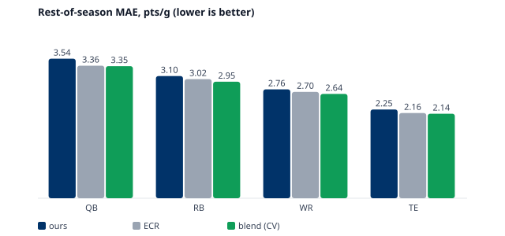
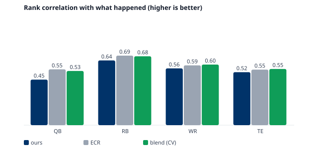
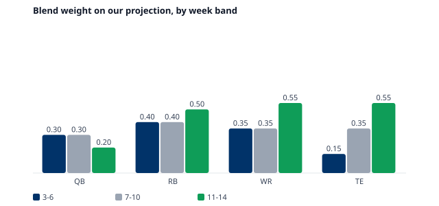
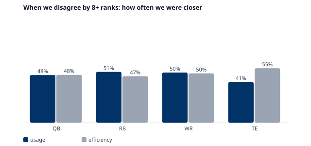

# Backtest — our rest-of-season projection vs FantasyPros ECR (HANDOFF v1.3 §4.3)

_Generated 2026-09-27 by `tools/backtest_ros.py`. Walk-forward 2021–2025, weeks 3–14, 59 season-weeks with an ECR scrape dated before kickoff. Pool: ECR top 30 QB/TE, top 60 RB/WR. Target: actual half-PPR pts per game played, weeks w–17 (min 3 games)._

## Fitted model

- EWMA half-life **h = 6 games**; share shrink **k_s = 2.0** games toward last season; team-volume shrink **k_t = 8** games; efficiency shrink **k_eff = 16** games.
- ECR is converted to points by giving the k-th ranked player our k-th highest projection at his position that week (§4.2), so the comparison is in points while ECR stays a pure (PPR) ordering.

## Accuracy by position

| Pos | n | MAE ours | MAE ECR | MAE blend (CV) | ρ ours | ρ ECR | ρ blend (CV) |
|---|---|---|---|---|---|---|---|
| QB | 1621 | 3.54 | 3.36 | 3.35 | 0.450 | 0.551 | 0.535 |
| RB | 3296 | 3.10 | 3.02 | 2.95 | 0.639 | 0.686 | 0.680 |
| WR | 3313 | 2.76 | 2.70 | 2.64 | 0.561 | 0.590 | 0.598 |
| TE | 1656 | 2.25 | 2.16 | 2.14 | 0.523 | 0.548 | 0.554 |

Blend is scored leave-one-season-out: its weight is fitted on the other four seasons.

## Blend weights (share on our projection)

| Pos | 3–6 | 7–10 | 11–14 |
|---|---|---|---|
| QB | 0.30 | 0.30 | 0.20 |
| RB | 0.40 | 0.40 | 0.50 |
| WR | 0.35 | 0.35 | 0.55 |
| TE | 0.15 | 0.35 | 0.55 |

No position-band came out at w ≈ 0, so our projection carries weight everywhere.

## Disagreement hit rate (≥ 8 position ranks apart)

| Pos | Driver | n | Ours closer | Tag allowed |
|---|---|---|---|---|
| QB | efficiency | 81 | 48% | no |
| QB | usage | 463 | 48% | no |
| RB | efficiency | 171 | 47% | no |
| RB | usage | 1401 | 51% | no |
| TE | efficiency | 73 | 55% | no |
| TE | usage | 379 | 41% | no |
| WR | efficiency | 252 | 50% | no |
| WR | usage | 1447 | 50% | no |

Driver: *usage* when the usage-only projection (expected points, no efficiency term) is itself 8+ ranks from ECR in the same direction; otherwise *efficiency*. A tag is shown only where the hit rate beats 55% on at least 30 disagreements; everything else reads "consensus view".

## Early-signal test

Players with a rising-usage flag (TGT, AIR, SNAP, LEAD, GL, ROLE+) and < 30% rostered (FantasyPros average; unranked players count as low-owned): how often they finished ROS top-36 RB/WR or top-15 TE, against unflagged low-owned players at the same position.

| Pos | Flagged | n | Finished top |
|---|---|---|---|
| RB | no | 3677 | 3.8% |
| RB | yes | 901 | 9.3% |
| TE | no | 4884 | 4.2% |
| TE | yes | 308 | 13.6% |
| WR | no | 8136 | 3.0% |
| WR | yes | 278 | 8.3% |

## p10 / p90 calibration

Weekly scores as multiples of the per-game projection, by position and projection tier, fitted on 2021–23 and checked on 2024–25 (target ≈ 80% of weeks inside the band):

| Pos | 2024–25 coverage |
|---|---|
| QB | 74.3% |
| RB | 80.1% |
| TE | 80.7% |
| WR | 78.7% |

## Forward-schedule reliability (from HANDOFF_matchups.md)

Does the week-w read of a team's remaining opponents predict what those games did to its position group? Pass = Spearman > 0.10 with t > 2 on team-seasons as the effective sample.

| Pos | Spearman | team-seasons | t | Schedule lens |
|---|---|---|---|---|
| QB | -0.036 | 160 | -0.5 | off |
| RB | 0.113 | 160 | 1.4 | off |
| WR | 0.076 | 160 | 0.9 | off |
| TE | 0.164 | 160 | 2.1 | on |

## Caveats

- DynastyProcess scrapes are Fridays, after Thursday night's game, so ECR has seen one game ours has not in each walk-forward week. That favours ECR slightly.
- Rookies with no NFL snaps before week w have no projection of ours and are excluded from the comparison; in production they fall back to ECR.
- ECR is a PPR ranking; only its order is used, mapped onto our half-PPR scale.
